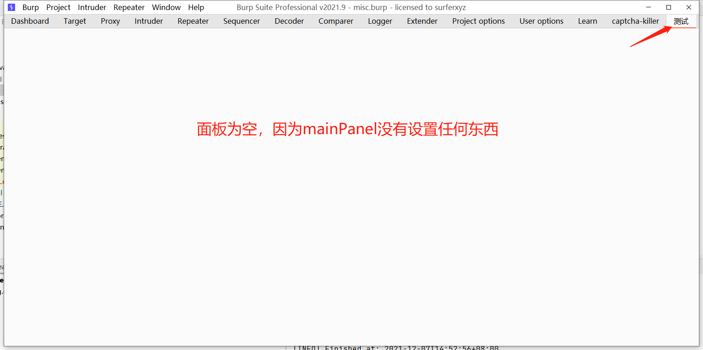

# Demo：新建一个扩展项

```bash
E:\GITHUB\BURPLEARN
├─.idea
├─src
│  ├─main
│  │  ├─java
│  │  │  └─burp
│  │  └─resources
│  └─test
│      └─java
└─target
```

BurpExtender.java

```java
package burp;

import java.awt.Component;
import java.io.PrintWriter;
import javax.swing.JPanel;
import javax.swing.SwingUtilities;

public class BurpExtender implements IBurpExtender, ITab, IHttpListener{

    public JPanel mainPanel;
    public PrintWriter stdout;
    public IExtensionHelpers hps;
    public IBurpExtenderCallbacks cbs;
    public ITextEditor iRequestTextEditor;
    public ITextEditor iResponseTextEditor;

    @Override
    public void registerExtenderCallbacks(IBurpExtenderCallbacks callbacks) {

        callbacks.setExtensionName("JSON 水坑检测");

        this.hps = callbacks.getHelpers();
        this.cbs = callbacks;
        this.stdout = new PrintWriter(callbacks.getStdout(), true);
        this.stdout.println("hello burp!");

        SwingUtilities.invokeLater(new Runnable() {
            @Override
            public void run() {

                mainPanel = new JPanel(null);

                iRequestTextEditor = cbs.createTextEditor();
                iRequestTextEditor.setEditable(false);

                iResponseTextEditor = cbs.createTextEditor();
                iResponseTextEditor.setEditable(false);

                cbs.customizeUiComponent(mainPanel);
                cbs.addSuiteTab(BurpExtender.this);
            }
        });
        callbacks.registerHttpListener(this);
    }

    // 实现 ITab 接口的 getTabCaption 方法
    @Override
    public String getTabCaption() {
        return "测试";
    }

    // 实现 ITab 接口的 getUiComponent 方法
    @Override
    public Component getUiComponent() {
        return mainPanel;
    }

    @Override
    public void processHttpMessage(int i, boolean b, IHttpRequestResponse iHttpRequestResponse) {

    }
}
```



